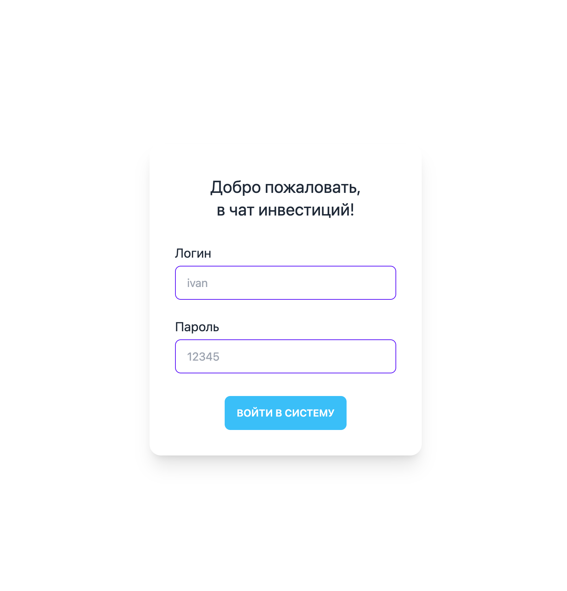
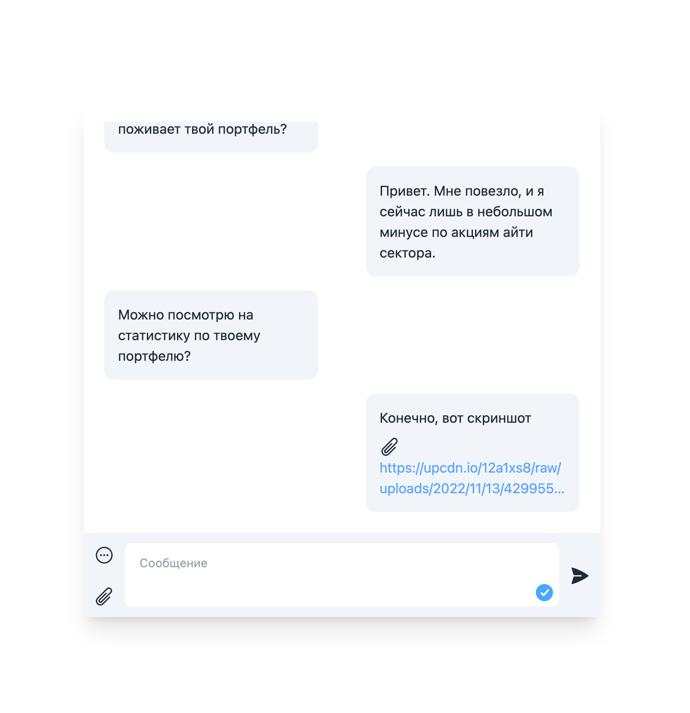
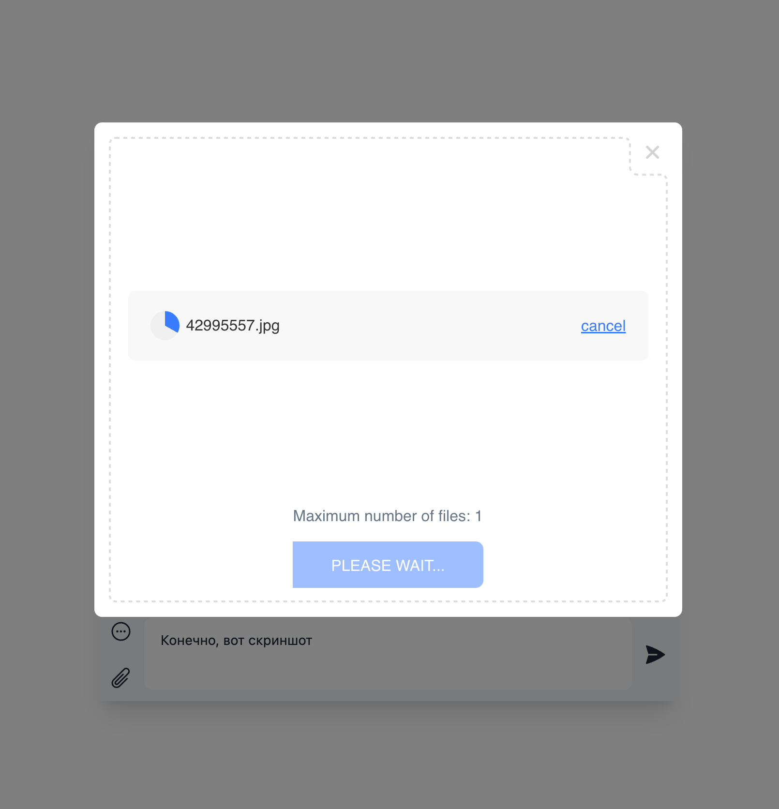
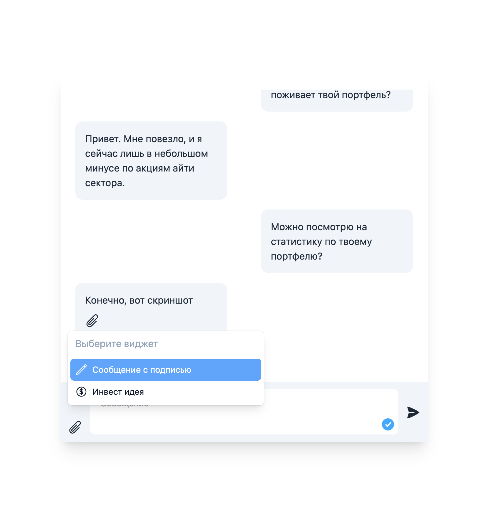
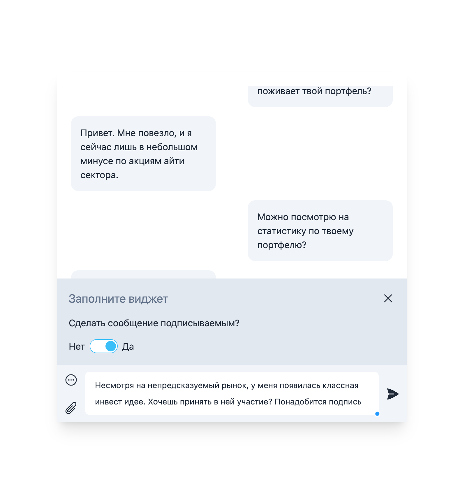
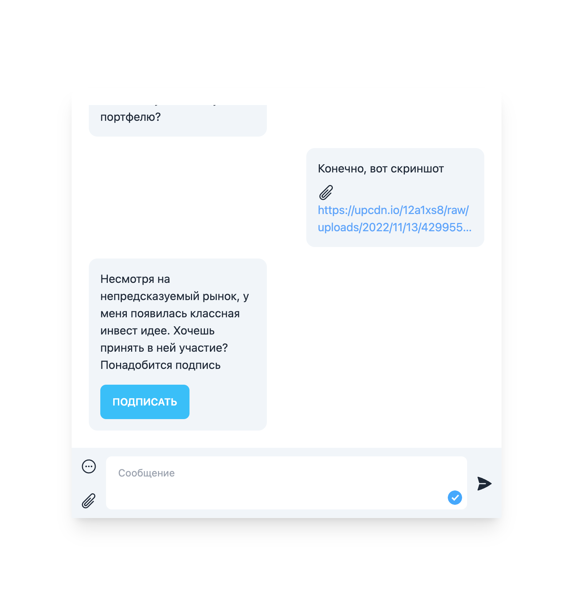
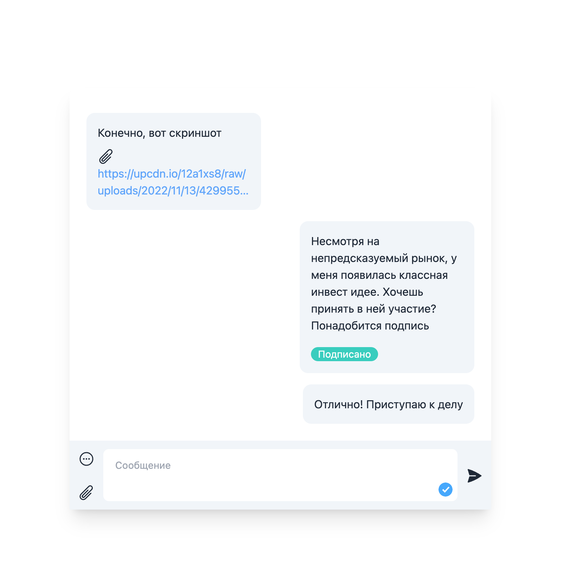

# Хакатон Hack & Change
## Трек: 2 "Advisory сервис для Открытие Инвестиции"

[Файлы хакатона](https://drive.google.com/drive/folders/1GnO0WG_2_fXJ0HWqj4wYTZ_NgqAi1yIM)

[Тестовое API](https://documenter.getpostman.com/view/7834747/2s8YepsXyp)


> Время на выполнение проекта: вечер пятницы - утро воскресенья.
> 
> Потраченное время на реализацию: 26 часов
>
> _26 часов Без сна..._
### Что это за проект
Веб-интерфейс к интерактивному чату с дополнительным функционалом, который помогает инвестиционному консультанту и его клиенту обсуждать инвестиционные идеи.

### Функционал
1. Аутентификация через JWT токен
2. Просмотр сообщений в чате
3. Отправка сообщений разных видов:
   1. Текст
   2. Прикрепленный документ
   3. Виджет с возможностью попросить собеседника его подписать
   4. [Не успели, но очень хотели] : виджет для отправки инвестиционной идеи. Прямо в чате должен был отображаться график акции и точка (дата + цена акции), которая является прогнозом консультанта для клиента. Для этого виджета половину кода написать все-таки успели.


### Showcase

Логин



<br>

Первый экран чата и загрузка файлов

  

Виджеты для лучшего UX

  


Подписание виджета

  


### Запуск программы

В корне проекта (на одном уровне с файлом package.json), нужно выполнить команды

```shell
  npm i
  npm dev # откроет проект по порту 3000
```

Затем проект можно открыть в браузере по ссылке http://localhost:3000/login.

** Также, команда `npm dev-other` запускает второй инстанс проекта по порту 3333.

После авторизации в этих инстансах под разными аккаунтами между ними можно вести переписку.
  `


###Используемые технологии
- NextJS
- TypeScript
- Tailwindcss
- react-query

<br>

---

<br>
